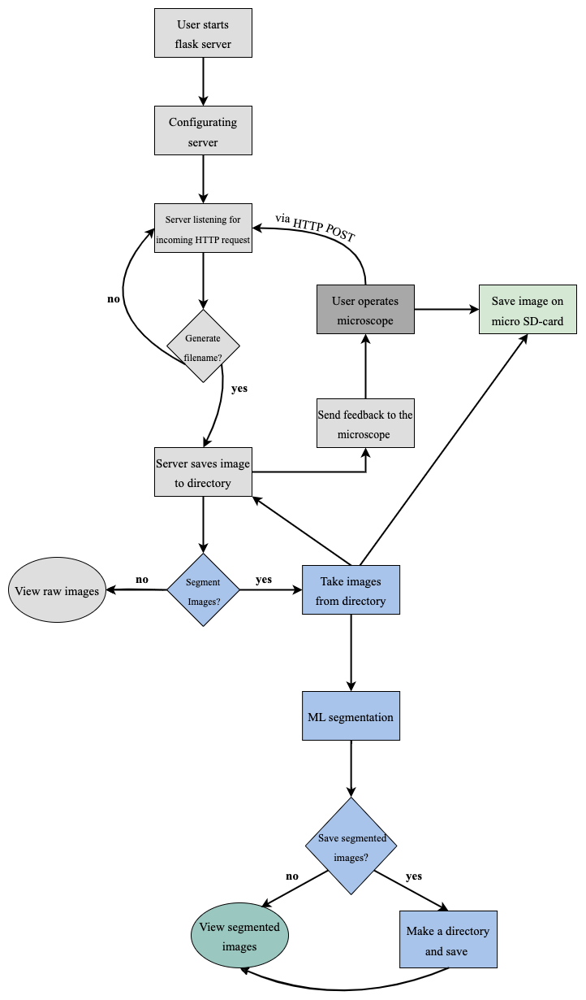

# Master Thesis Project - Development of a Complete Minuscule Microscope: Embedding Data Pipeline and Machine Learning Segmentation

## Description
The aim of my master thesis was to develop a microscope using comercially available components for monitoring cells in incubators. The microscope developed was 
cost-effective with small dimensions. The images taken with the microscope are wirelessly sent to a computer via a server where they can be segmented for
monitoring cell proliferation and apoptosis. You can read the thesis on the following link: https://urn.kb.se/resolve?urn=urn:nbn:se:kth:diva-338696 or through
searching for the TRITA-number: TRITA-SCI-GRU ; 2024:367. Find further technical information below.

## Hardware Components
The main hardware components used are:
* ESP32-CAM with 4MB PSRAM
* ESP32-Dev
* 2MP OmniVision Camera (model OV2640)
* MB-adapter

## Languages
The code was written in:
* Python
* C++
* C

The code for the microscope and the microscope lights where written in VS Code with the PlatformIO extension. PlatformIO can be installed as an 
extension in VS Code from the Visual Studio Marketplace. Once installed, it adds new menus and toolbars to VS Code for accessing PlatformIO's features.

## General Workflow of the Microscope
<table>
<tr>
<td>

</td>
<td>

The microscope system comprises several distinct functions that works together. Each function is designed to operate autonomously with the only common 
factor being the data (images) generated by the ESP32-Cam. As seen in the figure to the left, the user initiates a Flask server which listens for HTTP POST requests
from the microscope. The images taken with the microscope are saved to a specified directory on a computer. The images are also saved on the micro-SD card that
the microscope comprises. The user will be asked if the images should be segmented. If so, the pre-trained segmentation algorithm (created using Cellpose)
will segment those images and save them on the machine. If the user do not want to segment the images, they will simply be displayed. For further in-depth explanation,
read the thesis on the link under 'description'. 

</td>
</tr>
</table>

## Libraries
### For the Microscope
#### Standard Libraries and Modules
* **<Arduino.h>**: Standard library for Arduino framework, providing basic I/O operations and initialisations.
* **esp_camera.h**: ESP32 Camera Driver; used for interfacing with the ESP32 camera module.
* **<WiFi.h>**: Wi-Fi library for ESP32, used for Wi-Fi connectivity features.
* **FS.h** and **SD_MMC.h**: Filesystem and SD card libraries for ESP32, used for accessing the file system and SD card operations.
* **soc/soc.h** and **soc/rtc_cntl_reg.h**: Libraries for handling SOC (System On a Chip) specific features, including disabling brownout problems.
* **driver/rtc_io.h**: Real-Time Clock (RTC) I/O library, likely used for low-level hardware control.
* **<HTTPClient.h>**: HTTP client library for making HTTP requests from the ESP32.

#### Specific Definitions and Configurations
* **#define CAMERA_MODEL_AI_THINKER**: This indicates that the AI-THINKER model of the ESP32-CAM is used. 

#### Functional Components
* **Camera Initialization and Configuration**: Setting up the ESP32 camera module with specific pins and settings (JPEG format, frame size, quality, etc.).
* **Wi-Fi Access Point Setup**: Initialising the ESP32 as a Wi-Fi access point using predefined SSID and password.
* **HTTP Server Communication**: Functionality to upload images to a server via HTTP POST requests.
* **Filesystem Operations**: Creating directories and saving images to the SD card.
* **Camera Capture and Processing**: Capturing images at intervals, toggling between different folders for saving, and handling image data.

#### Required Setup for Compitalion and Execution
* **PlatformIO with ESP32 Platform**: Ensure that your PlatformIO environment is set up for ESP32 development.
* **Dependencies**: Make sure all the mentioned libraries are accessible in your PlatformIO project. Most of these libraries (WiFi, FS, SD_MMC, HTTPClient)
are standard for ESP32 development in PlatformIO and should be included with the ESP32 platform package.
* **Camera Model**: The CAMERA_MODEL_AI_THINKER preprocessor directive assumes you have an AI-THINKER ESP32-CAM module.
* **Network Configuration**: Adjust the SSID and macServerUrl to match your network and server settings.

#### Additional Notes
* **camera_pins.h**: This file should contain the pin definitions for the AI-THINKER camera model. They are provided in "Microscope/src/camera_pins.h".
* **Project Configuration (platformio.ini)**: The platformio.ini file with the board, framework and monitor speed is provided in "Microscope/platformio.ini"

### For the Microscope Lights
#### Standard Libraries
* **<Arduino.h>** (see explanation above)

#### Pin Definitions
* The code directly controls GPIO pins specified in the code. However, you can use other pin definitions. Check your hardware specification so that
they are available first!

### Non-Standard Libraries
To download these libraries, find them on GitHub and follow the instructions.

* **ESPAsyncWebServer** and **AsyncTCP**: For creating asynchronous web servers on the ESP32.
* **WiFiManager**: Helps manage Wi-Fi connections and credentials.
 
## For the User: General
1. Clone this repository. You can do it by typing **git clone https://github.com/ZecKenan/MicroscopeMaster.git** into your terminal.
2. Open PlatformIO (assuming you downloaded that extension), navigate to *File* and select *New Project*.
3. Navigate to the directory where you cloned the repository, select it and click *Open*.

### For the User: Microscope
1. In the Microscope/src/main.cpp, change the macServerUrl to your IP-address and port. You can find your IP-address in the network settings. Make sure
it ends with the "/upload".
2. In the server code (*ServerRun.py*), change the path to where the file with the images should be saved. Include this at the end of the path: /pic{}.jpg’.format(image_counter). Now start the server by running the server code.
3. Upload the Microscope code to an ESP32-CAM.
4. Upload the MicroscopeLight code to an ESP32-Dev.
5. Run the server code.

The microscope is now taking images every 2.5 minutes (to change the interval, change the *unsigned long delayTime* to a desired time. The time should 
be in ms!). The images are sent to your computer. For segmentation, open the MicroscopeMaster/Segmentation/Segmentation.py - file and follow the instructions
given there. For troubleshooting, check out Appendix B in the thesis which you can find under "Description". 

## For the Developer
In this thesis, two separate microcontrollers are used for the microscope (ESP32-CAM) and for the light (ESP32-Dev). However, the ESP32-CAM is fully capable of doing these tasks alone. Furthermore, the ESP32 has an output voltage of 3.3V. An Op-amp should be implemented to enable 12V light sources in order to get dark-field images. The illumination system could be improved by automatising it so that it can move in the z-direction. Since the cells are living, they naturally move, grow in height, and experience drift. To maintain consistent image quality, the light source must adjust accordingly. To detect when the light source has to move, a kernel with an arbitrary size could be deployed to transverse through the acquired image and calculate the change in intensity. This in turn can be used as training data to train a machine learning algorithm to correlate change in intensity with change in the height of the illumination setup.

### Check Out
Also check out Matchboxscope on GitHub for a prototype!
